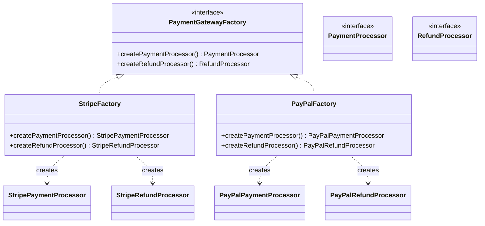

# Abstract Factory Design Pattern

This module demonstrates the implementation of the Abstract Factory design pattern in Java 25 and Spring Boot.

## Intent
The Abstract Factory pattern provides an interface for creating families of related or dependent objects without specifying their concrete classes. It ensures that the client only uses objects that are compatible with each other.

In this module, we use the Abstract Factory pattern to manage **Payment Gateways** (Stripe vs PayPal). 
A payment gateway integration typically requires multiple related components, such as a component to process payments and another to process refunds. The Abstract Factory ensures that we never mix a Stripe payment processor with a PayPal refund processor by accident.

## Implementation Details
We define abstract interfaces for the products (`PaymentProcessor` and `RefundProcessor`) and an abstract factory (`PaymentGatewayFactory`).

* **Abstract Products**: `PaymentProcessor`, `RefundProcessor`
* **Concrete Products (Stripe)**: `StripePaymentProcessor`, `StripeRefundProcessor`
* **Concrete Products (PayPal)**: `PayPalPaymentProcessor`, `PayPalRefundProcessor`
* **Abstract Factory**: `PaymentGatewayFactory`
* **Concrete Factories**: `StripeFactory`, `PayPalFactory`

The concrete factories are exposed as Spring components (`@Component("stripeFactory")` and `@Component("paypalFactory")`). 
The `CheckoutService` takes a `PaymentGatewayFactory` as a parameter and uses it to instantiate the correct set of payment and refund objects, guaranteeing compatibility within the selected gateway family.

### Class Diagram

