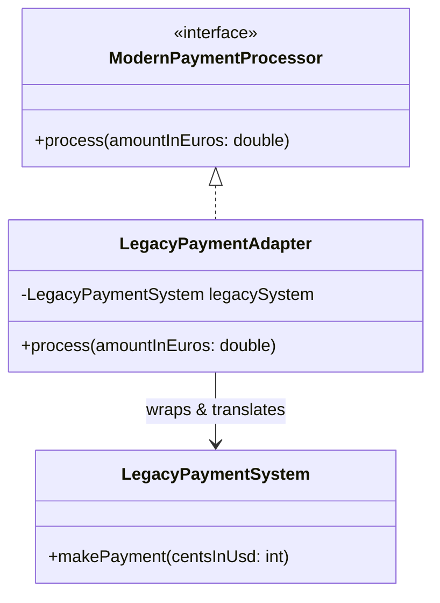

# adapter Design Pattern

This module demonstrates the implementation of the adapter design pattern in Java 25 and Spring Boot.

## Intent
(To be detailed based on the pattern)

## Implementation Details
This module contains the codebase for com.mla.designpattern.adapter package.

### Class Diagram

