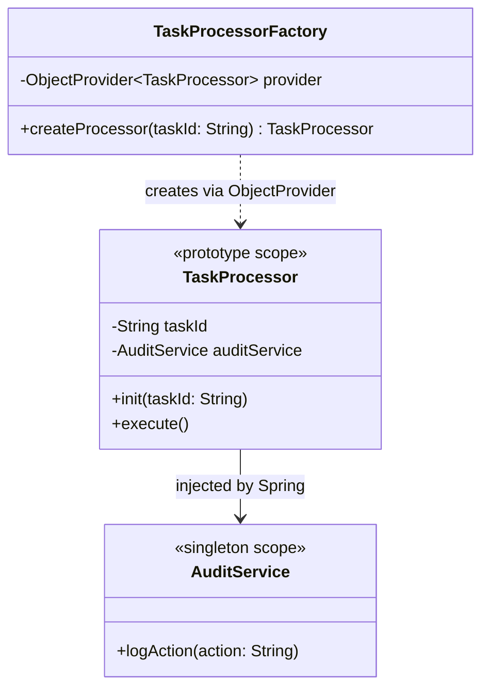

# Factory Design Pattern

This module demonstrates two distinct ways to implement the Factory pattern in Java 25, tailored for both classic OOP design and modern Spring Boot architecture.

## 1. Classic GoF Factory Method (`com.mla.designpattern.factory.gof`)
### Intent
Define an interface for creating an object, but let subclasses decide which class to instantiate. Factory Method lets a class defer instantiation to subclasses.

### Implementation Details
We define an abstract creator `ReportGenerator` that implements some core business logic (`generateReport()`) but leaves the actual instantiation of the `Report` object to its abstract method `createReport()`. Subclasses like `PdfReportGenerator` and `CsvReportGenerator` implement this method to return the specific type of report they handle.

## 2. Spring Prototype Factory (`com.mla.designpattern.factory.spring`)
### Intent
In the Spring ecosystem, standard Beans are Singletons. However, sometimes we need to create objects that contain specific state (and thus cannot be singletons) but still require Spring's Dependency Injection for other services.

### Implementation Details
* **The Product (`TaskProcessor`)**: Annotated with `@Component` and `@Scope("prototype")`. This tells Spring to create a brand new instance every time this bean is requested. It also receives an `AuditService` via dependency injection.
* **The Factory (`TaskProcessorFactory`)**: Uses Spring's `ObjectProvider<TaskProcessor>` to ask the Spring ApplicationContext for a new instance of `TaskProcessor` on demand, and then initializes its specific state (`taskId`). This bridges the gap between Spring-managed dependencies and stateful object instantiation.

### Class Diagram

