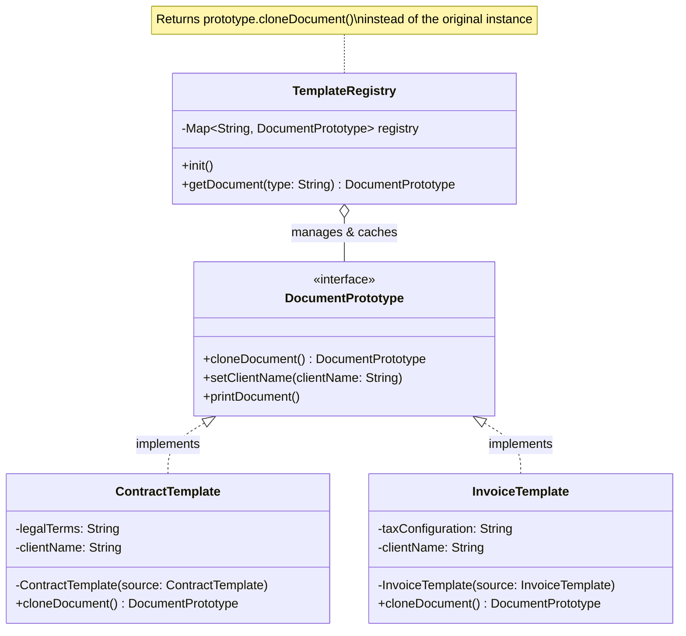

# Prototype Design Pattern

This module demonstrates the implementation of the Prototype design pattern in Java 25 and Spring Boot.

## Intent
The Prototype pattern delegates the cloning process to the actual objects that are being cloned. It is used to instantiate new objects by copying an existing object (the prototype). This is extremely useful when creating an object is expensive (e.g., requires database calls, parsing large configurations) and we just want to duplicate a pre-configured template and modify a few attributes.

*Note: Do not confuse the Gang of Four Prototype Design Pattern (cloning an existing object with its state) with Spring's `@Scope("prototype")` (which instructs Spring to create a brand new, empty instance with injected dependencies).*

## Implementation Details
In this example, we implemented a Document Template Registry for an enterprise application.

* **`DocumentPrototype`**: An interface defining the `cloneDocument()` method.
* **`ContractTemplate` / `InvoiceTemplate`**: The concrete products containing heavy configurations (simulated).
* **`TemplateRegistry`**: A Spring `@Service` that acts as the Prototype Registry. During its initialization (`@PostConstruct`), it creates and caches the heavy template objects. When the client requests a document type, the registry looks up the template and returns a **clone** of it, allowing the client to safely modify it without affecting the cached template.

### Class Diagram

