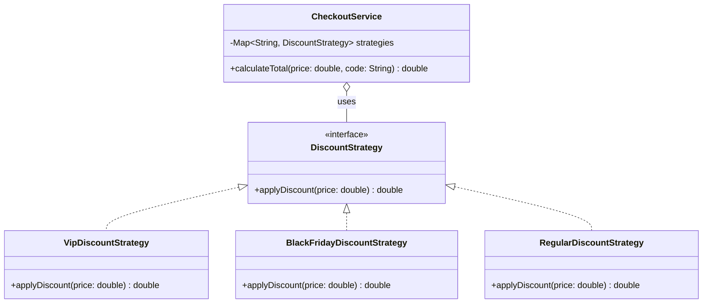

# Strategy Design Pattern

This module demonstrates the implementation of the Strategy design pattern in Java 25 and Spring Boot.

## Intent
The Strategy pattern defines a family of algorithms, encapsulates each one, and makes them interchangeable. Strategy lets the algorithm vary independently from clients that use it. 
In this module, we use the Strategy pattern to apply different discount rules (VIP, Black Friday, Regular) dynamically at checkout.

## Implementation Details
This module showcases a modern approach to the Strategy pattern by leveraging **Spring Boot Dependency Injection**.
Instead of using manual `if/else` or `switch` statements to pick a strategy, we define multiple beans implementing `DiscountStrategy` and assign them specific names (`@Component("VIP")`).

The context, `CheckoutService`, injects a `Map<String, DiscountStrategy>`. Spring automatically populates this map where the key is the component name and the value is the strategy instance. This makes it incredibly easy to add new discount rules in the future without modifying the core checkout logic—simply add a new class annotated with `@Component`.

* **Strategy Interface**: `DiscountStrategy`
* **Concrete Strategies**: `VipDiscountStrategy`, `BlackFridayDiscountStrategy`, `RegularDiscountStrategy`
* **Context**: `CheckoutService`

### Class Diagram

